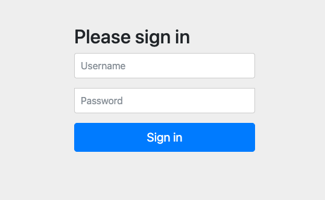

# Authorization Server Example

## Description

This project represents an OAuth2 Authorization Server. In this project, we define client's registrations like
`client-id`, `client-secret`, `authorization-types`, `scopes`, and `redirect-uri`.

For the Authorization Server, we have two users registered in the memory database:
- `one` with password `pw` and roles `admin` and `user`.
- `two` with password `pw` and role `user`.

There are three projects in this repository:
- [Authorization Server](authorization-server): It represents the Authorization Server itself.
- [Resource Server](resource-server): It contains restricted resources that can be accessed by the client after the client has been authorized by the [Authorization Server](authorization-server).
- [Oauth Client](oauth-client): It represents the client that will access the [Resource Server](resource-server) after being authorized by the [Authorization Server](authorization-server).

## Features
- Java 21
- Spring Boot 3.2.3
- Spring Authorization Server

## How to start

Run the command:

```bash
$ make start
```

You can start the project with native image with the command:
```bash
$ make native-start
```
With Native Image, applications can run faster, use less memory, and be more secure as shown [here](https://github.com/valdemarjuniorr/spring-boot-graalvm-performance-comparation).


## How to use

After `make start` or `make native-start` command, it will start the Authorization Server, Resource Server, and Oauth Client. And then, it will
open the browser with the Oauth Client page as below:



Set Login as `one` and Password as `pw` and click on the `Sign In` button. It will redirect to the Resource Server resources, returning the message:
```json
{
  "id": 0,
  "description": "Hey one, here are the product 0"
}
```
## References

[Spring Tips: The Spring Authorization Server](https://www.youtube.com/watch?v=Yh8t04NG_K4)
