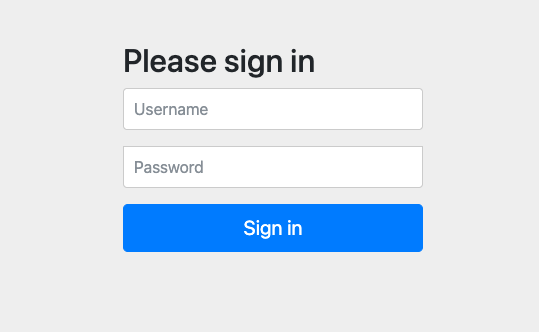

# Authorization Server Example

## Description

This project represents an OAuth2 Authorization Server. In this project, we define client's registrations like
`client-id`, `client-secret`, `authorization-types`, `scopes`, and `redirect-uri`.

For this Authorization Server, we have two users registered in the memory database:
- `one` with password `pw` and roles `admin` and `user`.
- `two` with password `pw` and role `user`.

## Features
- Java 21
- Spring Boot 3.2.3

## How to start

Run the command:

```bash
$ make start
```

You can start the project with native image with the command:
```bash
$ make native-start
```
With Native Image, applications can run faster, use less memory, and be more secure as shown [here](https://github.com/valdemarjuniorr/spring-boot-graalvm-performance-comparation).

## How to use
After starting the application, you can access http://localhost:8080/ to see the Login Page as below:



## References

[Spring Tips: The Spring Authorization Server](https://www.youtube.com/watch?v=Yh8t04NG_K4)
