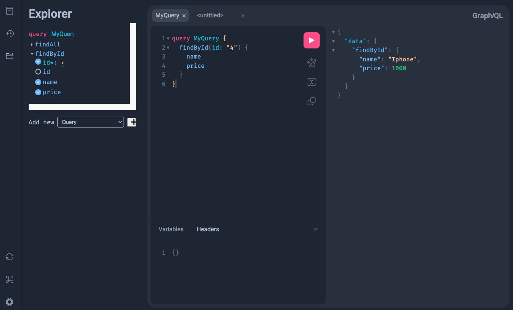

# GraphQL Example

## Description

This project is a CRUD example of how to use GraphQL with Spring Boot. We have a simple record `Product` with the following fields `id`, `name`, and `price`.
In this example we have `Query` and `Mutation` to get and create products. The schema is defined in the `product.graphqls` file.

## Features

- Java 22
- Docker
- Postgres
- Spring Boot 3.3.1
- GraphQL

## How to start

Run the command:

```shell
$ make start
```

You can start the project with native image with the command:

```shell
$ make native-start
```

With Native Image, applications can run faster, use less memory, and be more secure as
shown [here](https://github.com/valdemarjuniorr/spring-boot-graalvm-performance-comparation).

## How to use

After starting the application, you can open [Postman](https://www.postman.com/) and create `Query` as
described [here](https://learning.postman.com/docs/sending-requests/graphql/graphql-client-first-request/),
and set the URL to [http://localhost:8080/graphql](http://localhost:8080/graphql).

Another way to test the application is to use the [GraphiQL](https://www.electronjs.org/apps/graphiql) tool. You can access it by opening the browser
and typing [http://localhost:8080/graphiql](http://localhost:8080/graphiql) and you can try using queries and mutations, as shown below:



## References
- [Master Graphql with Spring Boot](https://www.youtube.com/watch?v=eD-1KTK7fGc)
