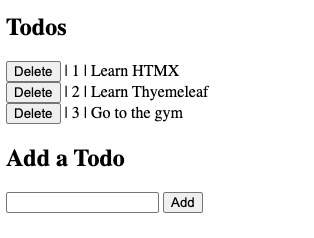

# HTMX Example

## Description
This is a simple CRUD example using HTMX integrating with Spring Boot to create/delete a todos list.

## Features
- Java 23
- Spring boot 3.3.x
- Thymeleaf
- HTMX

## How to start
Run the command:

```shell
$ make start
```

You can start the project with native image with the command:
```shell
$ make native-start
```
With Native Image, applications can run faster, use less memory, and be more secure as shown [here](https://github.com/valdemarjuniorr/spring-boot-graalvm-performance-comparation).

## How to use
After the application starts, you can access the URL [http://localhost:8080/todos](http://localhost:8080/todos) and it will open the page as below:



## References
- [Spring tips](https://www.youtube.com/watch?v=j-rfPoXe5aE)
- [HTMX Docs](https://htmx.org/docs/)