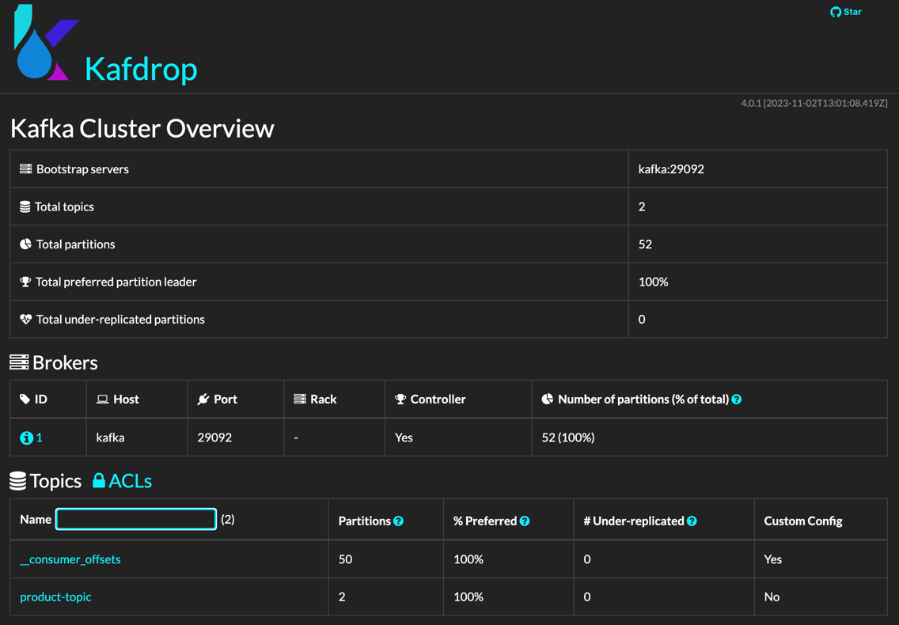

# Kafka Example

## Description
This project is a simple example of how to use Kafka with Spring Boot. We will use [kafdrop](https://github.com/obsidiandynamics/kafdrop) to show local kafka cluster UI.
It has a topic called `product-topic` which we will send messages to it towards REST API.

## Features
- Java 21
- Spring 3.2.3
- [Spring for Apache Kafka](https://docs.spring.io/spring-boot/docs/3.2.3/reference/htmlsingle/index.html#messaging.kafka)
- [kafdrop](https://github.com/obsidiandynamics/kafdrop)

## How to start
First clone the project

```shell
$ git clone git@github.com:valdemarjuniorr/springboot3-examples.git
```

and then, start the project locally, running the command:
```shell
$ cd kafka-example
$ make start
```

You can start the project with native image with the command:
```shell
$ make native-start
```
With Native Image, applications can run faster, use less memory, and be more secure as shown [here](https://github.com/valdemarjuniorr/spring-boot-graalvm-performance-comparation).

### KafDrop
After the application started, you can access the kafdrop UI at [http://localhost:19000/](http://localhost:19000/). It will show a screen like this:



## How to use
To create a new user run the `curl`:

```shell
curl --location 'http://localhost:8080/products' \
--header 'Content-Type: application/json' \
--data '{
    "id": 1,
    "description": "sending message"
}'
```

## References
- [Apache Kafka + Kafdrop + Docker Compose](https://medium.com/azure-na-pratica/apache-kafka-kafdrop-docker-compose-montando-rapidamente-um-ambiente-para-testes-606cc76aa66)
- [Unit Testing Kafka Producer with EmbeddedKafkaBroker](https://jskim1991.medium.com/spring-kafka-unit-testing-kafka-producer-with-embeddedkafkabroker-c26afee691b5)
