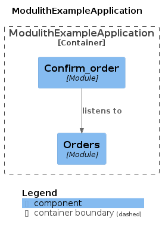

# Spring Modulith Example

## Description
This project is an example of how to use [Spring Modulith](https://spring.io/projects/spring-modulith) to create a modular monolith application. In this example we have two modules: `order` and `confirmation_order` as documented using [Documenting Application Modules](https://docs.spring.io/spring-modulith/reference/documentation.html):



The communication between modules is made using RabbitMQ Exchange. The `order` module sends a message to the `confirmation_order` module when an order is created and save in the database.

An interesting feature of Spring Modulith is the ability to register [event publication schemas](https://docs.spring.io/spring-modulith/reference/appendix.html#schemas) to validate all events that are published in the application. This feature is very useful to avoid mistakes in the event publication. To do that set the property `spring.modulith.events.jdbc-schema-initialization.enabled` to `true`. 

# Features
- Docker
- Java 22
- Spring Boot 3.3.1
- Spring Modulith 1.2.0
- Postgres
- RabbitMQ

## How to start
Run the command:

```shell
$ make start
```

You can start the project with native image with the command:
```shell
$ make native-start
```
With Native Image, applications can run faster, use less memory, and be more secure as shown [here](https://github.com/valdemarjuniorr/spring-boot-graalvm-performance-comparation).

## How to use
To create an order and see the confirmation order, you can use the following command:

```shell
curl --location 'http://localhost:8080/orders' \
--header 'Content-Type: application/json' \
--data '{
    "quantity": 1,
    "productId": 1
}'
```

## References
- [Spring Tips: Spring Modulith](https://www.youtube.com/watch?v=MYEx0kO2-8A)

## Trouble Shooting
- The main application must be in the same package as `service` package is. Otherwise, it will not validate the module's dependencies as you can see [here](https://docs.spring.io/spring-modulith/reference/fundamentals.html#modules.simple)